# flutter_tugas_2
Nama    : Kissyin Syahbinar
Kelas   : MI 2C/12
NIM     : 2031710091

# Hasil Screnshoot textwidget
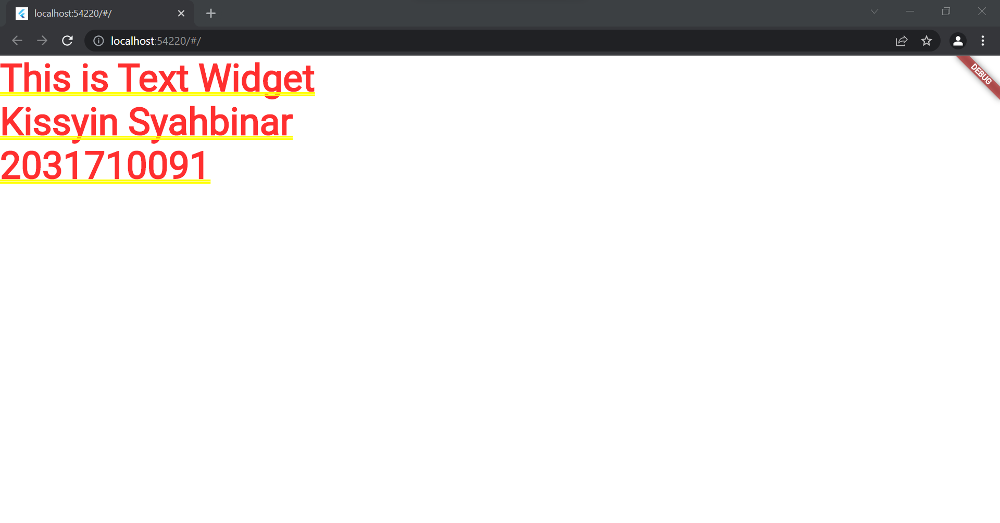

# Hasil Screnshoot button
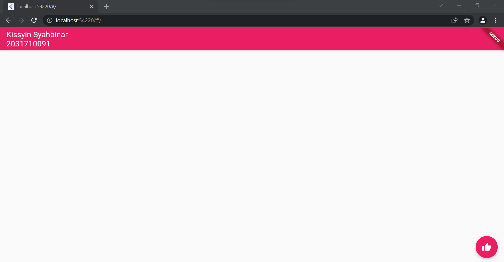

# Hasil Screnshoot dialog
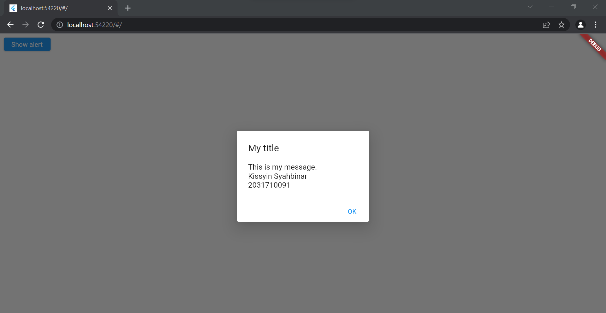

# Hasil Screnshoot input
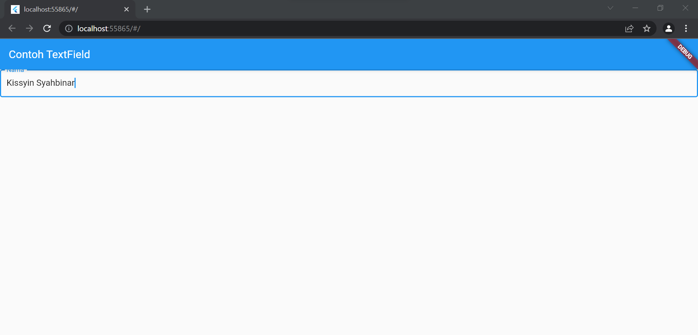

# Hasil Screnshoot date

# Hasil Screnshoot scaffold
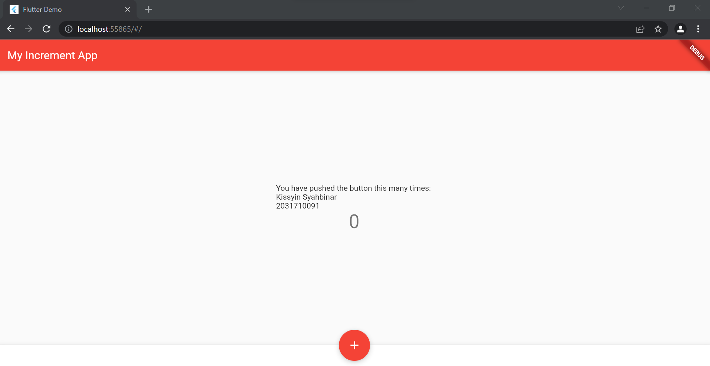

# Hasil Screnshoot material_widget
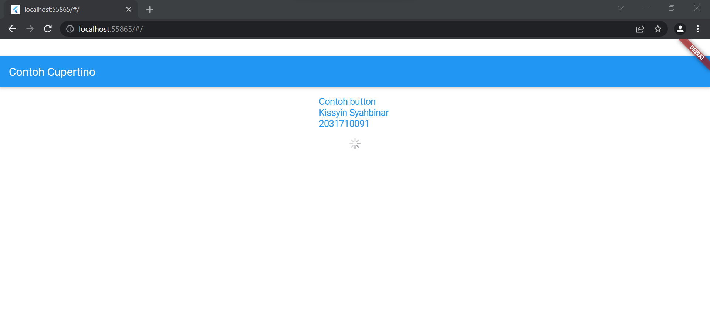

# Hasil Screnshoot grid
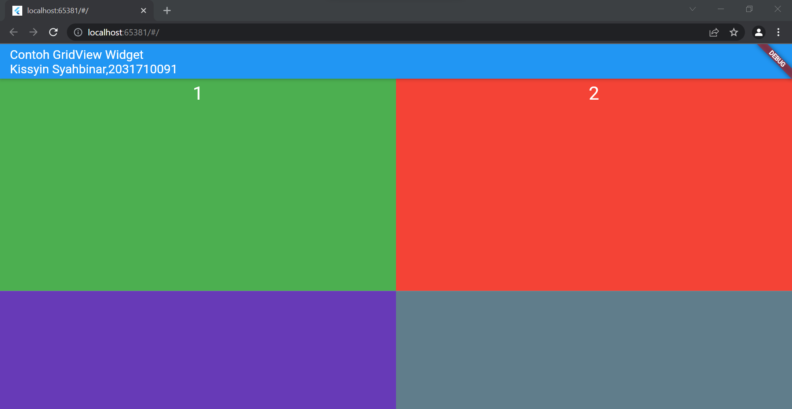

# Hasil Screnshoot column
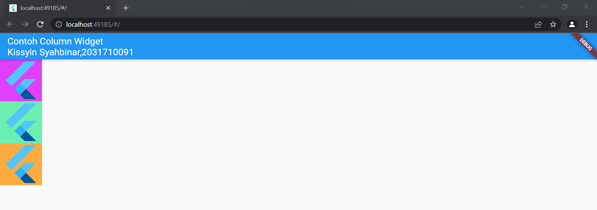

# Hasil Screnshoot list
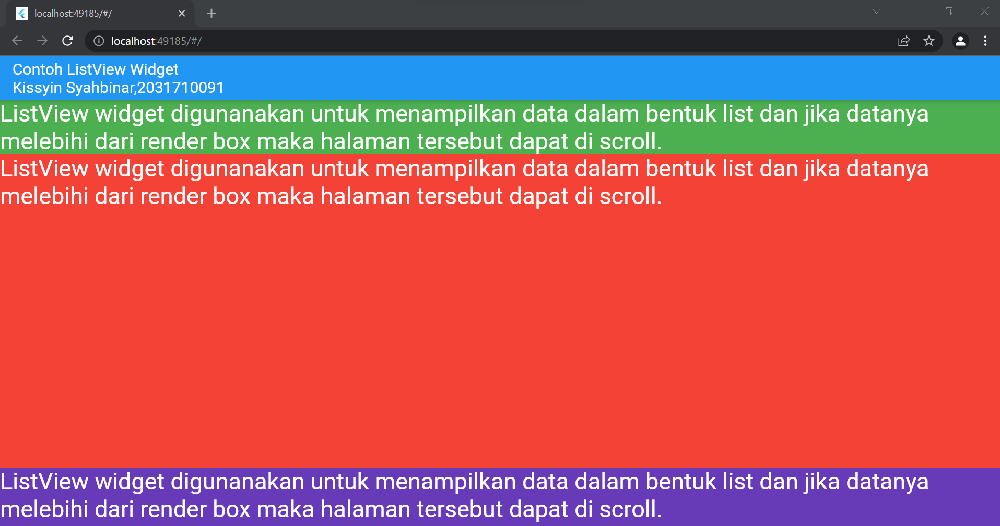

# Hasil Screnshoot row
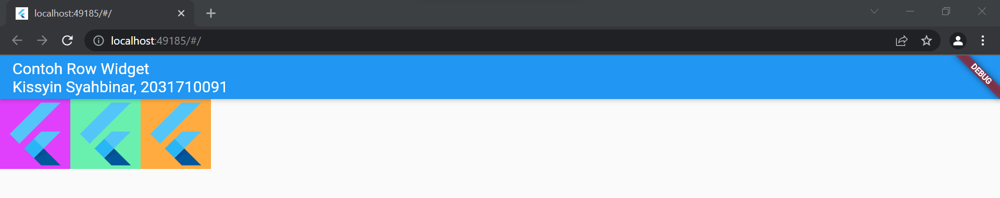

# Hasil Screnshoot stack
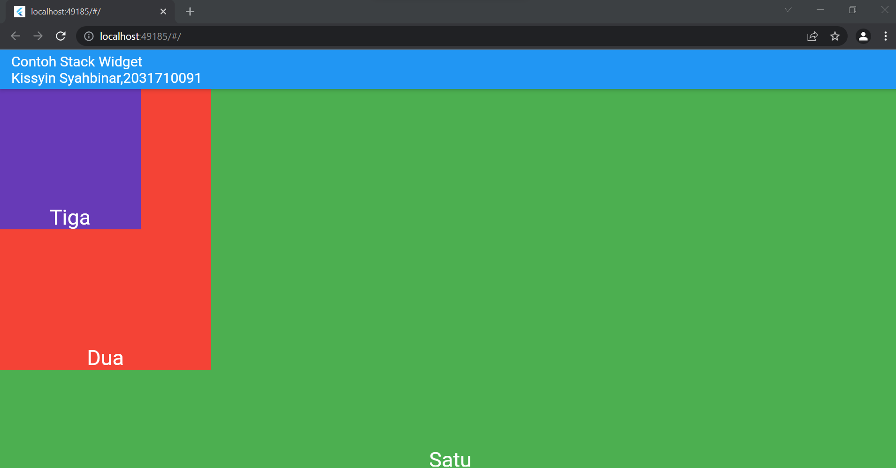

# Hasil Screnshoot property_alignment
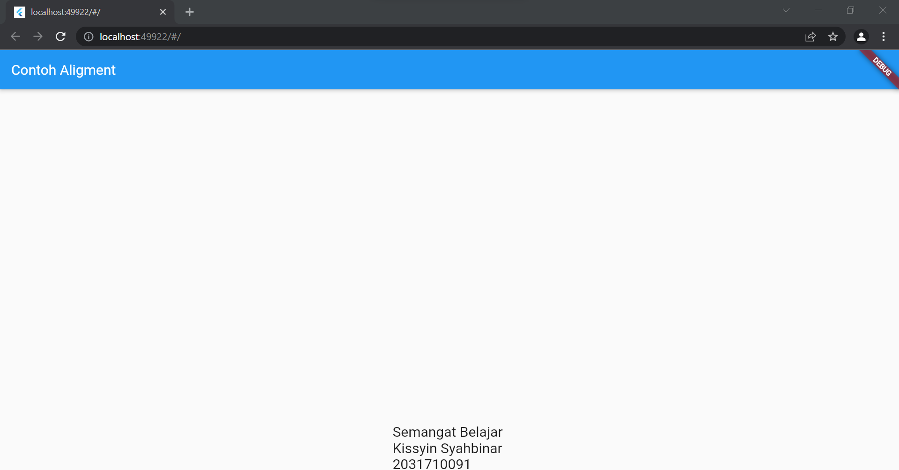

# Hasil Screnshoot property_child
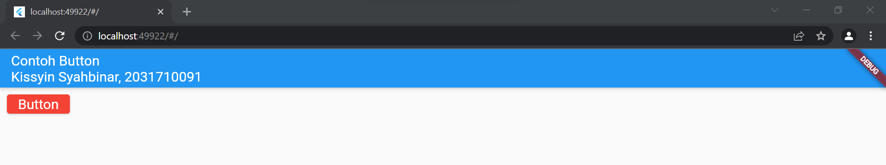

# Hasil Screnshoot property_color
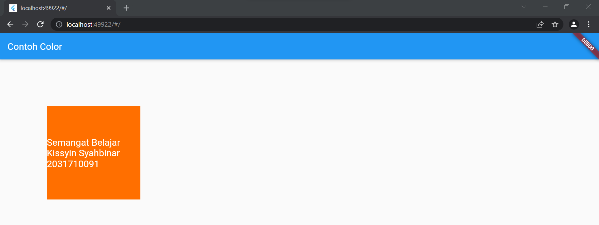

# Hasil Screnshoot property_decoration
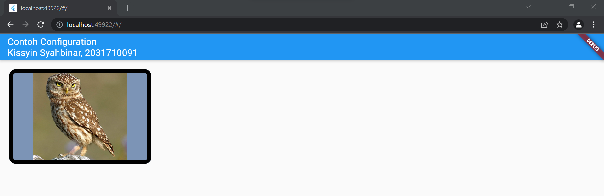

# Hasil Screnshoot property_margin
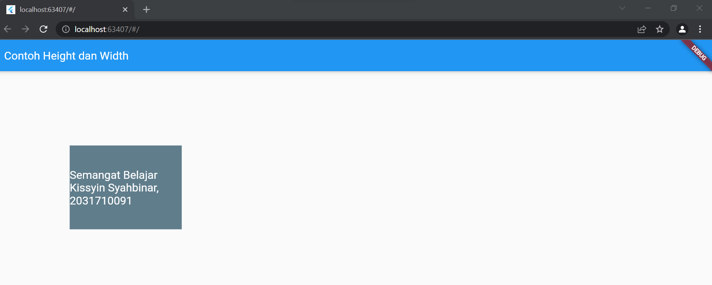

# Hasil Screnshoot property_padding
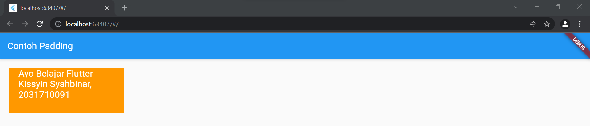

# Hasil Screnshoot tugas_praktikum
