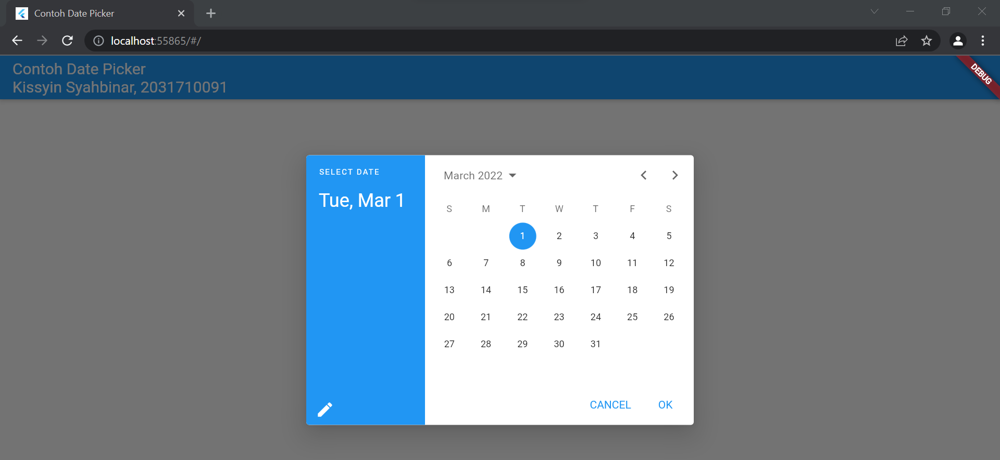
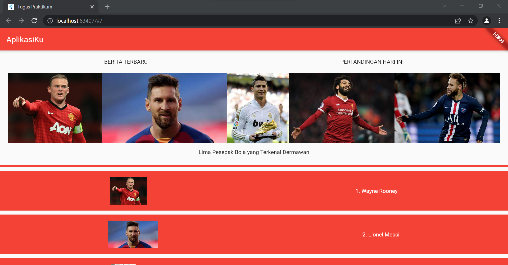

# flutter_tugas_2
Nama    : Kissyin Syahbinar
Kelas   : MI 2C/12
NIM     : 2031710091

# Hasil Screnshoot textwidget

# Hasil Screnshoot button

# Hasil Screnshoot dialog

# Hasil Screnshoot input

# Hasil Screnshoot date

# Hasil Screnshoot scaffold

# Hasil Screnshoot material_widget

# Hasil Screnshoot grid

# Hasil Screnshoot column

# Hasil Screnshoot list

# Hasil Screnshoot row

# Hasil Screnshoot stack

# Hasil Screnshoot property_alignment

# Hasil Screnshoot property_child

# Hasil Screnshoot property_color

# Hasil Screnshoot property_decoration

# Hasil Screnshoot property_margin

# Hasil Screnshoot property_padding

# Hasil Screnshoot tugas_praktikum
